# Lab 2 - Landing page

Create a web page for your/friends/relatives business (example: car-rent, cookies-shop, crypto-scam)

## Customer requirements

- Some form of navigation to sections (links, buttons)
- Call to action
- At least 4 sections ([see examples](https://webflow.com/blog/high-converting-landing-page))
- Pleasant to the eyes

## Dev requirements

- Use vanilla CSS and HTML (no frameworks)
- Have a decent git history (no one commit)
- The page should be deployed on a free hosting service (example: GitHub Pages, Vercel, Netlify)
- Project repo should have a README with a short description of the landing page topic, screenshots, and a link to the live demo

## Other requirements:

- For potential maximal mark, a WIP version should be submitted during the class
- Use index.html, reset.css

---

# 🚗 AutoFix - Professional Auto Repair & Maintenance

AutoFix is a responsive landing page for an **auto repair and maintenance service**. It provides information about services, pricing, and contact details, with a simple and clean design.

## 🌍 Live Demo
🔗 [https://tum-web-lab2-one.vercel.app/](https://tum-web-lab2-one.vercel.app/) 

## 📌 Features
- **Responsive design** 
- **Smooth navigation** with section links  
- **Service details & pricing**  
- **Contact form with Google Maps integration** 
- **Call-to-action buttons** for bookings
- **Animated Mascot** for branding and engagement  

## 📸 Screenshots

### **Hero Section**
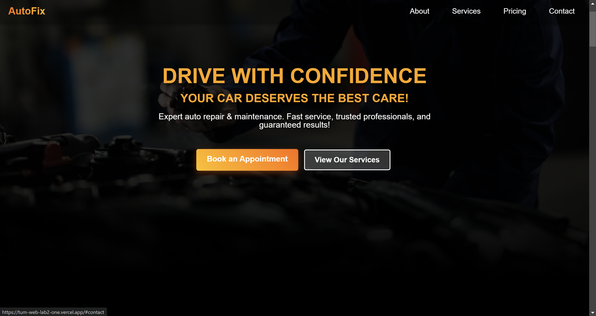

### **About Us**

  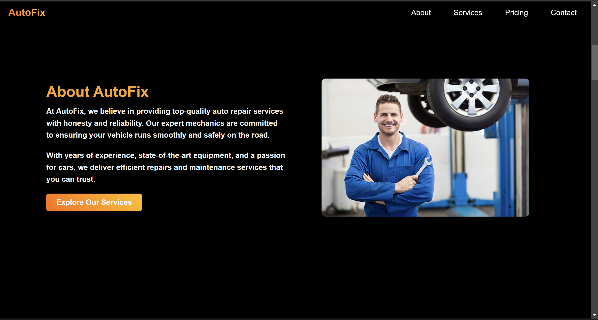
  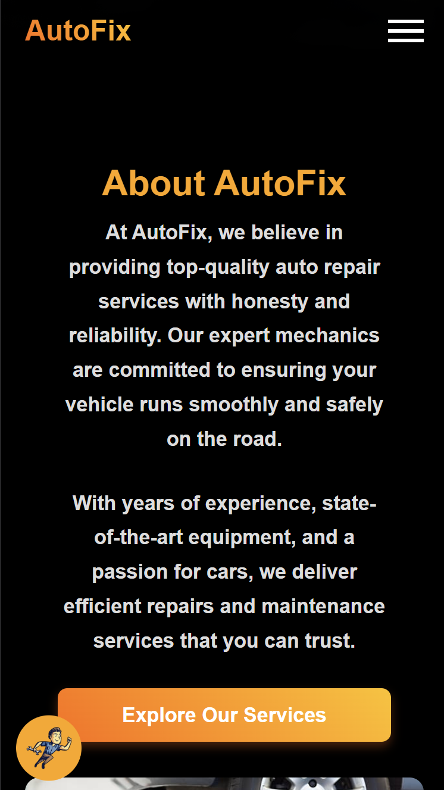

### **Why Choose Us**

  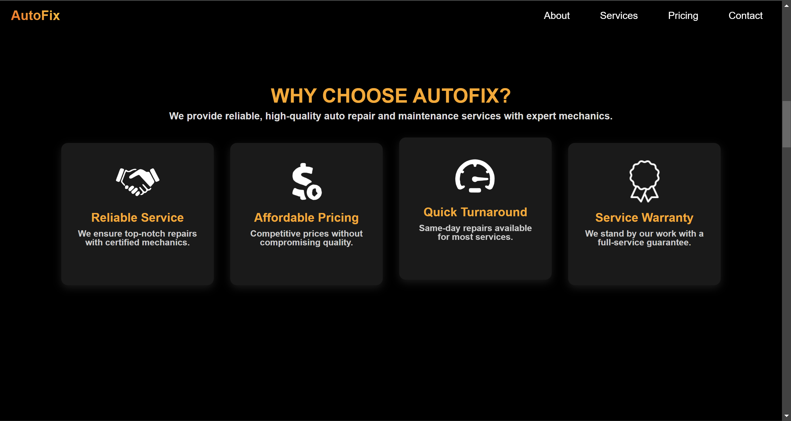
  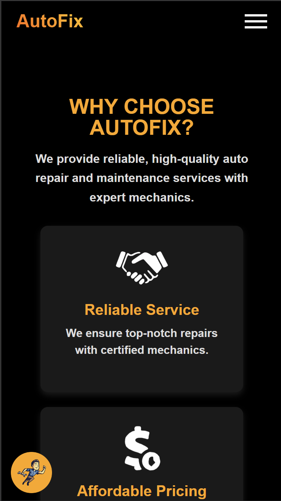

### **Services**

  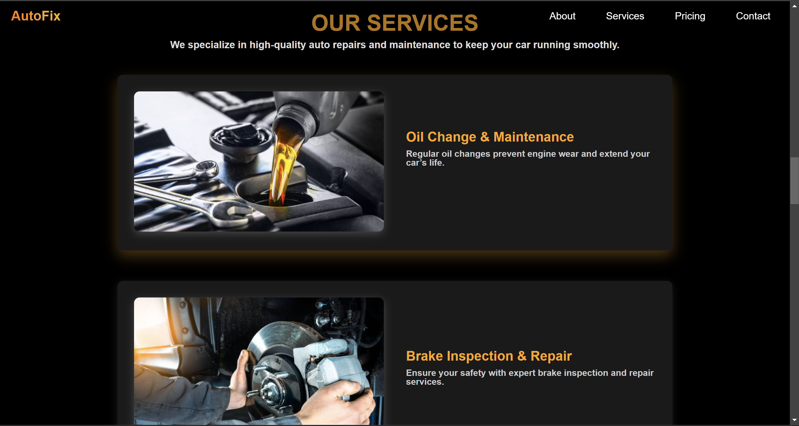
  

### **Pricing**

  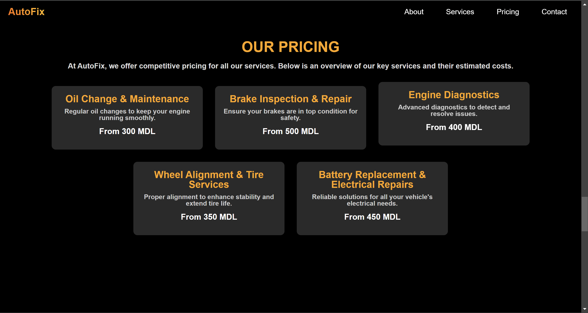
  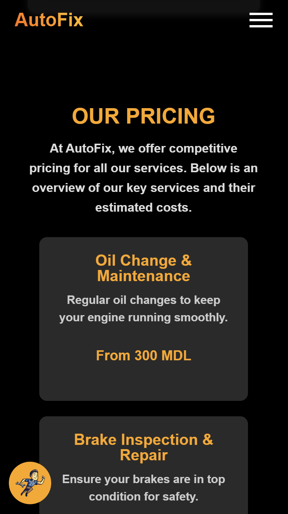

### **Contact Section**

  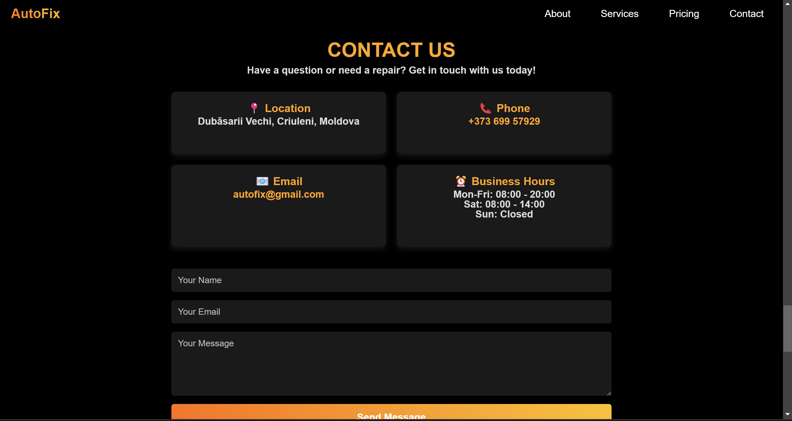
  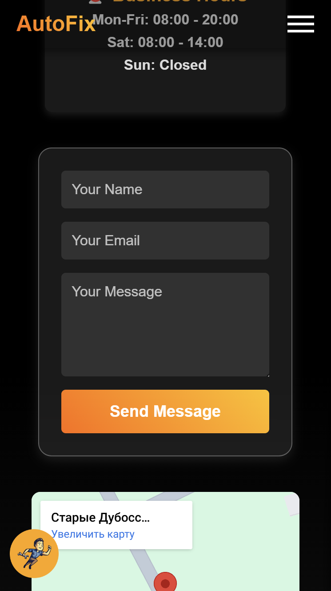

### **Footer**
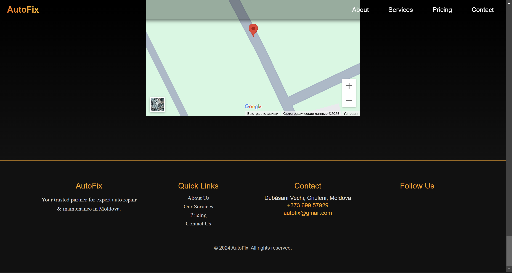

### **Mascot**
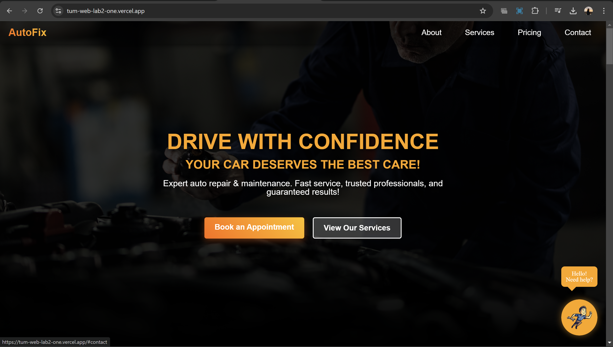

### **Mobile-Only**
The mobile-only hamburger menu provides a compact navigation solution for smaller screens. Instead of displaying the navbar, it hides the navigation links behind a toggle button

  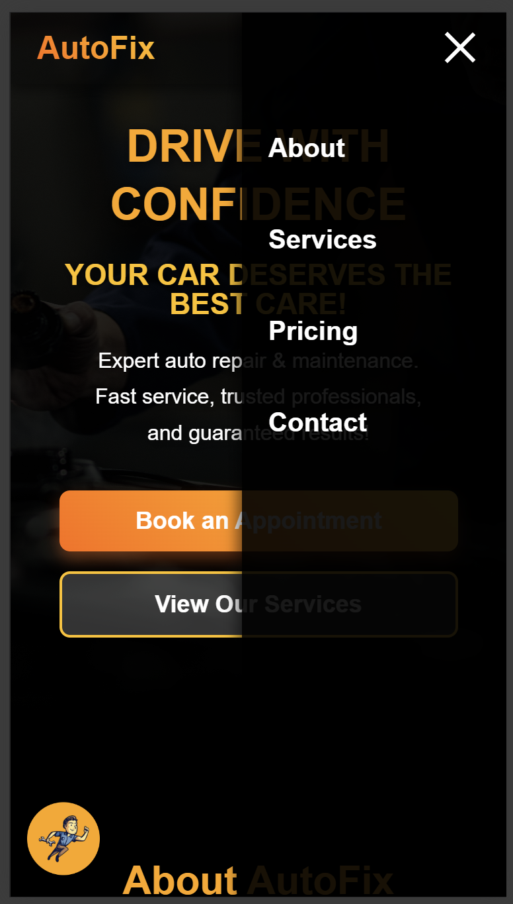

